  

  
  
  

<h3 align="center">懒，熬夜，涩涩。</h3>

  白天低功耗运行，晚上开始加载奇怪想法。 
  代码会错，坑会踩，觉会少睡，xp 会自己长出来。

  <a href="https://github.com/yxxawa?tab=repositories">repositories</a>
  ·
  <a href="https://github.com/yxxawa?tab=stars">stars</a>

